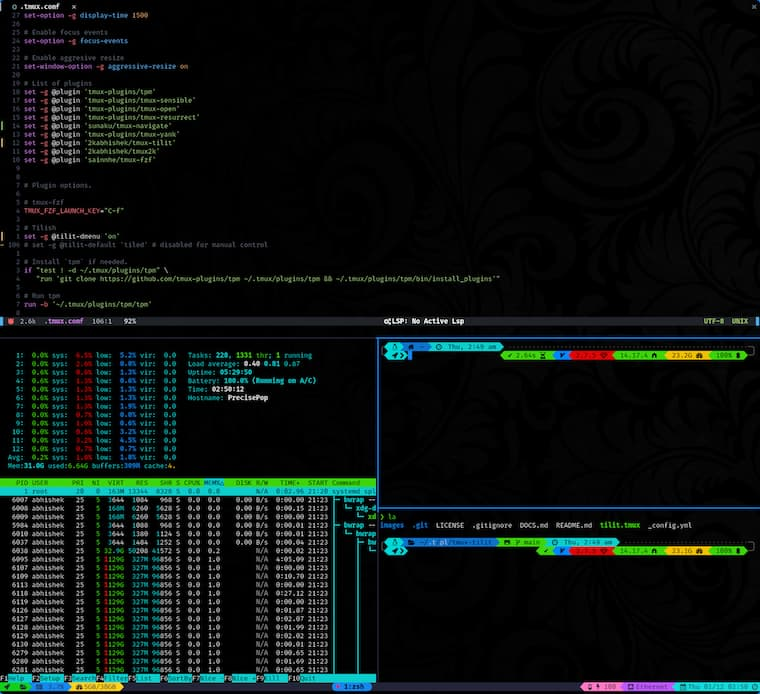

<div align = "center">

<h1><a href="https://2kabhishek.github.io/tmux-tilit">tmux-tilit</a></h1>

<a href="https://github.com/2KAbhishek/tmux-tilit/blob/main/LICENSE">
 </a>

<a href="https://github.com/2KAbhishek/tmux-tilit/graphs/contributors">
 </a>

<a href="https://github.com/2KAbhishek/tmux-tilit/stargazers">
</a>

<a href="https://github.com/2KAbhishek/tmux-tilit/network/members">
 </a>

<a href="https://github.com/2KAbhishek/tmux-tilit/watchers">
 </a>

<a href="https://github.com/2KAbhishek/tmux-tilit/pulse">
 </a>

<h3>Better tiling for tmux 🪟🪓</h3>

<figure>
  
  <br/>
  <figcaption>tmux-tilit screenshot</figcaption>
</figure>

</div>

## What is this

tmux-tilit is a tmux plugin that adds tiling window manager like features and keybindings to tmux.

## Inspiration

tmux-tilit was inspired by [tmux-tilish](https://github.com/jabirali/tmux-tilish).
I wanted to add some new commadns, make the keybindings match better with tmux's defaults, hence tilit was born!

## Prerequisites

Before you begin, ensure you have met the following requirements:

- You have installed the latest version of `tmux` and `tpm`.

## Installing tmux-tilit

To get tmux-tilit, add the following to your `~/.tmux.conf`:

```bash
set -g @plugin '2kabhishek/tmux-tilit'
```

## Using tmux-tilit

### Keybindings

Finally, here is a list of the actual keybindings. Most are [taken from `i3wm`][1].
Below, a "workspace" is what `tmux` would call a "window" and `vim` would call a "tab",
while a "pane" is what `i3wm` would call a "window" and `vim` would call a "split".

| Keybinding | Description |
| ---------- | ----------- |
| <kbd>Alt</kbd> + <kbd>0</kbd>-<kbd>9</kbd> | Switch to workspace number 0-9 |
| <kbd>Alt</kbd> + <kbd>Shift</kbd> + <kbd>0</kbd>-<kbd>9</kbd> | Move pane to workspace 0-9 |
| <kbd>Alt</kbd> + <kbd>h</kbd><kbd>j</kbd><kbd>k</kbd><kbd>l</kbd> | Move focus left/down/up/right |
| <kbd>Alt</kbd> + <kbd>Shift</kbd> + <kbd>h</kbd><kbd>j</kbd><kbd>k</kbd><kbd>l</kbd> | Move pane left/down/up/right |
| <kbd>Alt</kbd> + <kbd>Enter</kbd> | Create a new pane at "the end" of the current layout |
| <kbd>Alt</kbd> + <kbd>-</kbd> | Horizontal Split |
| <kbd>Alt</kbd> + <kbd>\</kbd> | Vertical Split |
| <kbd>Alt</kbd> + <kbd>s</kbd> | Switch to layout: split then vsplit |
| <kbd>Alt</kbd> + <kbd>Shift</kbd> + <kbd>s</kbd> | Switch to layout: only split |
| <kbd>Alt</kbd> + <kbd>v</kbd> | Switch to layout: vsplit then split |
| <kbd>Alt</kbd> + <kbd>Shift</kbd> + <kbd>v</kbd> | Switch to layout: only vsplit |
| <kbd>Alt</kbd> + <kbd>t</kbd> | Switch to layout: fully tiled |
| <kbd>Alt</kbd> + <kbd>z</kbd> | Switch to layout: zoom (fullscreen) |
| <kbd>Alt</kbd> + <kbd>r</kbd> | Refresh current layout |
| <kbd>Alt</kbd> + <kbd>n</kbd> | Name current workspace |
| <kbd>Alt</kbd> + <kbd>x</kbd> | Quit (close) pane |
| <kbd>Alt</kbd> + <kbd>d</kbd> | Exit (detach) `tmux` |
| <kbd>Alt</kbd> + <kbd>r</kbd> | Reload config |

For detailed instructions please read [DOCS](./DOCS.md)

## How it was built

tmux-tilit was built using `neovim`

## Challenges faced

Making sure the keybindings work accross different cli programs was challenging.

## What I learned

- Learned more about the tmux api.

## What's next

You tell me!

Hit the ⭐ button if you found this useful.

## More Info

[tmux-tilish](https://github.com/jabirali/tmux-tilish)

<div align="center">

<a href="https://github.com/2KAbhishek/tmux-tilit">Source</a> | <a href="https://2kabhishek.github.io/tmux-tilit">Website</a>

</div>
