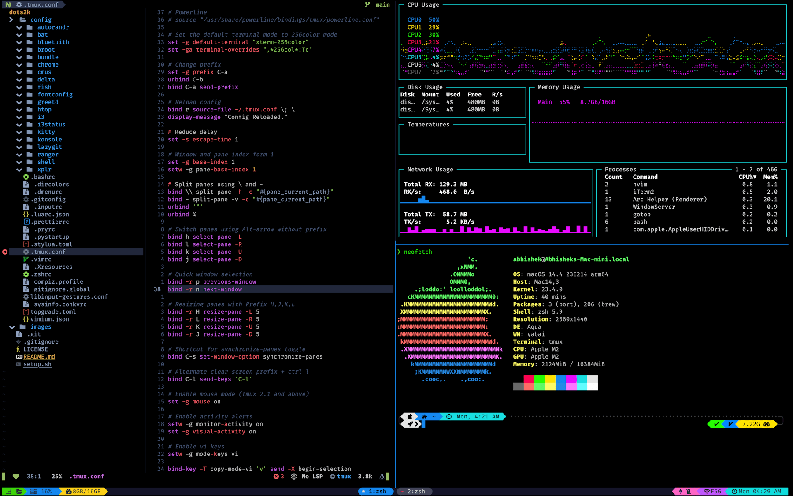

<div align = "center">

<h1><a href="https://2kabhishek.github.io/tmux-tilit">tmux-tilit</a></h1>

<a href="https://github.com/2KAbhishek/tmux-tilit/blob/main/LICENSE">
 </a>

<a href="https://github.com/2KAbhishek/tmux-tilit/graphs/contributors">
 </a>

<a href="https://github.com/2KAbhishek/tmux-tilit/stargazers">
</a>

<a href="https://github.com/2KAbhishek/tmux-tilit/network/members">
 </a>

<a href="https://github.com/2KAbhishek/tmux-tilit/watchers">
 </a>

<a href="https://github.com/2KAbhishek/tmux-tilit/pulse">
 </a>

<h3>Better tiling for tmux 🪟🪓</h3>

<figure>
  
  <br/>
  <figcaption>tmux-tilit screenshot</figcaption>
</figure>

</div>

## What is this

tmux-tilit brings tiling window manager features and smooth keybindings to your tmux sessions, boosting your productivity like never before.

## Prerequisites

Before you begin, ensure you have met the following requirements:

- You have installed the latest version of `tmux (>= 3.0)` and [`tpm`](https://github.com/tmux-plugins/tpm).

## Installing tmux-tilit

To get tmux-tilit, add the following to your `~/.tmux.conf`:

```bash
set -g @plugin '2kabhishek/tmux-tilit'
```

## Using tmux-tilit

### Keybindings

| Keybinding                                                  | Action                    |
| ----------------------------------------------------------- | ------------------------- |
| <kbd>Alt</kbd> + <kbd>`</kbd>                               | Last active window        |
| <kbd>Alt</kbd> + <kbd>,</kbd>                               | Rename current window     |
| <kbd>Alt</kbd> + <kbd>/</kbd>                               | Horizontal Split          |
| <kbd>Alt</kbd> + <kbd>\</kbd>                               | Vertical Split            |
| <kbd>Alt</kbd> + <kbd>[ or ]</kbd>                          | Focus prev/next window    |
| <kbd>Alt</kbd> + <kbd>- / =</kbd>                           | Increase / Decrease width |
| <kbd>Alt</kbd> + <kbd>&#8592;/&#8595;/&#8593;/&#8594;</kbd> | Resize pane in direction  |
| <kbd>Alt</kbd> + <kbd>0-9</kbd>                             | Switch to window 0-9      |
| <kbd>Alt</kbd> + <kbd>Enter</kbd>                           | Create a new pane         |
| <kbd>Alt</kbd> + <kbd>Shift + 0-9</kbd>                     | Move pane to window 0-9   |
| <kbd>Alt</kbd> + <kbd>Shift + C</kbd>                       | Customize mode            |
| <kbd>Alt</kbd> + <kbd>Shift + D</kbd>                       | Detach                    |
| <kbd>Alt</kbd> + <kbd>Shift + E</kbd>                       | Layout: Even Horizontal   |
| <kbd>Alt</kbd> + <kbd>Shift + H/J/K/L</kbd>                 | Move pane in direction    |
| <kbd>Alt</kbd> + <kbd>Shift + M</kbd>                       | Layout: Main Horizontal   |
| <kbd>Alt</kbd> + <kbd>Shift + R</kbd>                       | Rotate window             |
| <kbd>Alt</kbd> + <kbd>Shift + T</kbd>                       | Layout: Tiled             |
| <kbd>Alt</kbd> + <kbd>Shift + X</kbd>                       | Close window              |
| <kbd>Alt</kbd> + <kbd>a</kbd>                               | Command mode              |
| <kbd>Alt</kbd> + <kbd>b</kbd>                               | Toggle status bar         |
| <kbd>Alt</kbd> + <kbd>c</kbd>                               | Edit config               |
| <kbd>Alt</kbd> + <kbd>d</kbd>                               | tmux dmenu launcher       |
| <kbd>Alt</kbd> + <kbd>e</kbd>                               | Layout: Even Vertical     |
| <kbd>Alt</kbd> + <kbd>f</kbd>                               | Text grab, [extrakto][3]  |
| <kbd>Alt</kbd> + <kbd>g</kbd>                               | Open lazygit              |
| <kbd>Alt</kbd> + <kbd>h/j/k/l</kbd>                         | Focus pane in direction   |
| <kbd>Alt</kbd> + <kbd>i</kbd>                               | Open tilit Readme         |
| <kbd>Alt</kbd> + <kbd>m</kbd>                               | Layout: Main Vertical     |
| <kbd>Alt</kbd> + <kbd>n</kbd>                               | Show all notes, [tdo][1]  |
| <kbd>Alt</kbd> + <kbd>o</kbd>                               | Open floating terminal    |
| <kbd>Alt</kbd> + <kbd>p</kbd>                               | Last active pane          |
| <kbd>Alt</kbd> + <kbd>q</kbd>                               | Close session             |
| <kbd>Alt</kbd> + <kbd>r</kbd>                               | Reload config             |
| <kbd>Alt</kbd> + <kbd>s</kbd>                               | Switch between all panse  |
| <kbd>Alt</kbd> + <kbd>t</kbd>                               | Session manager, [tea][2] |
| <kbd>Alt</kbd> + <kbd>w</kbd>                               | Move pane to new window   |
| <kbd>Alt</kbd> + <kbd>x</kbd>                               | Close pane                |
| <kbd>Alt</kbd> + <kbd>z</kbd>                               | Layout: Zoom              |
| <kbd>Shift</kbd> + <kbd>&#8592;/&#8594;</kbd>               | Focus prev/next window    |

[1]: https://github.com/2KAbhishek/tdo
[2]: https://github.com/2KAbhishek/tmux-tea
[3]: https://github.com/laktak/extrakto

### Integrating with Neovim/Vim

To setup navigation with neovim install [Navigator.nvim][4] and for vim use [vim-tmux-navigator][5]

Then, in your `~/.tmux.conf` add:

```bash
set -g @tilit-navigator 'on'
```

This will let you seamlessly navigate between vim splits and tmux panes with <kbd>Ctrl</kbd> + <kbd>h</kbd><kbd>j</kbd><kbd>k</kbd><kbd>l</kbd>.

[4]: https://github.com/numToStr/Navigator.nvim
[5]: https://github.com/christoomey/vim-tmux-navigator

### Integrating with window managers

If your window manager uses <kbd>Alt</kbd> as default modifier, it's recommended to switch to <kbd>Super</kbd> or <kbd>Meta</kbd> for a smoother experience.

If you do not want to do that you can enable prefix mode and faster repeat-time in tmux:

```bash
set -g @tilit-prefix 'M-space'
set -g repeat-time 1000
```

This will let you hit <kbd>Alt</kbd> + <kbd>Space</kbd> and then a key to perform an action, repeat time lets you run more actions with a single prefix.

### Easy Mode

To navigate using arrow keys, you can enable `easy-mode`

    set -g @tilit-easymode 'on'

The revised keybindings for the pane focus and movement then become:

| Keybinding                                                          | Description              |
| ------------------------------------------------------------------- | ------------------------ |
| <kbd>Alt</kbd> + <kbd>&#8592;/&#8595;/&#8593;/&#8594;</kbd>         | Focus pane in direction  |
| <kbd>Alt</kbd> + <kbd>Shift + &#8592;/&#8595;/&#8593;/&#8594;</kbd> | Move pane in direction   |
| <kbd>Alt</kbd> + <kbd>h/j/k/l</kbd>                                 | Resize pane in direction |

### More Configs

```bash
# Default Workspace
set -g @tilit-default 'main-vertical'

# Sane defaults
set -s escape-time 0
set -g base-index 1
set -g repeat-time 1000

# Enable application launcher
set -g @tilit-dmenu 'on'

# Fix Shift + num keybinding for international keyboards
set -g @tilit-shiftnum '!"£$%^&*()' # for UK layout
```

## How I built this

Major credits to [tmux-tilish](https://github.com/jabirali/tmux-tilish) for the inspiration
I wanted to add some new commands and integrations, make the keybindings match better with tmux defaults.

## Challenges faced

Making sure the keybindings work across different command line programs and environments was challenging.

## What I learned

- Learned more about the tmux api.

## What's next

You tell me!

Hit the ⭐ button if you found this useful.

### 🧰 Tooling

- [dots2k](https://github.com/2kabhishek/dots2k) — Dev Environment
- [nvim2k](https://github.com/2kabhishek/nvim2k) — Personalized Editor
- [sway2k](https://github.com/2kabhishek/sway2k) — Desktop Environment
- [qute2k](https://github.com/2kabhishek/qute2k) — Personalized Browser

### 🔍 More Info

- [tmux-tea](https://github.com/2kabhishek/tmux-tea) — Simple and powerful tmux session manager
- [tmux2k](https://github.com/2kabhishek/tmux2k) — Makes your tmux statusbar pretty!

<div align="center">

<a href="https://github.com/2KAbhishek/tmux-tilit">Source</a> | <a href="https://2kabhishek.github.io/tmux-tilit">Website</a>

</div>
